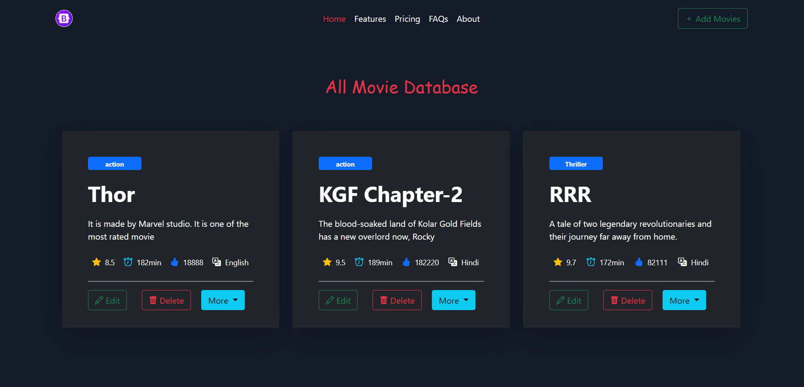

# MEAN_App

## File Structure 


## Main Page


### I have implemented these methods
    - GET
    - POST
    - PUT
    - DELETE

### GET Movies Api
```JavaScript

    router.get('/', (req,res)=>{
    movie.find((err,doc)=>{
        if(err){
            console.log("error in getting the data")
        }else{
            res.send(doc);
        }
    })
})
```

### GET Single Movie Api

```JavaScript
    router.get('/:id', (req,res)=>{

    if(objectId.isValid(req.params.id)){
        movie.findById(req.params.id, (err,doc)=>{
             if(err){
                console.log("error in getting single movie ")
                }else{
                    res.send(doc)
                }
        })
    }else{
        return res.status(400).send("No record found with Id"+ req.params.id)
    }

})

```

### POST Api

```JavaScript

    router.post('/', (req, res)=>{
    let mv = new movie({
        title : req.body.title,
        desc :req.body.desc,
        rating: req.body.rating,
        duration: req.body.duration,
        genre: req.body.genre,
        likes: req.body.likes,
        language: req.body.language,
        watched: req.body.watched
    });
    mv.save((err, doc)=>{
        if(err){
            console.log("error in post data");
        }else{
            res.send(doc);
        }
    })
})
```

### PUT Api

```JavaScript
    router.put('/:id', (req,res)=>{

    if(objectId.isValid(req.params.id)){

         let mv ={
        title : req.body.title,
        desc :req.body.desc,
        rating: req.body.rating,
        duration: req.body.duration,
        genre: req.body.genre,
        likes: req.body.likes,
        language: req.body.language,
        watched: req.body.watched
    };

        movie.findByIdAndUpdate(req.params.id, {$set: mv}, {new: true}, (err,doc)=>{
             if(err){
                console.log("error in deleting single movie ")
                }else{
                    res.send(doc)
                }
        })
    }else{
        return res.status(400).send("No record found with Id"+ req.params.id)
    }

})

```
### DELETE Api

```JavaScript
    router.delete('/:id', (req,res)=>{

    if(objectId.isValid(req.params.id)){
        movie.findByIdAndRemove(req.params.id, (err,doc)=>{
             if(err){
                console.log("error in deleting single movie ")
                }else{
                    res.send(doc)
                }
        })
    }else{
        return res.status(400).send("No record found with Id"+ req.params.id)
    }

})
```